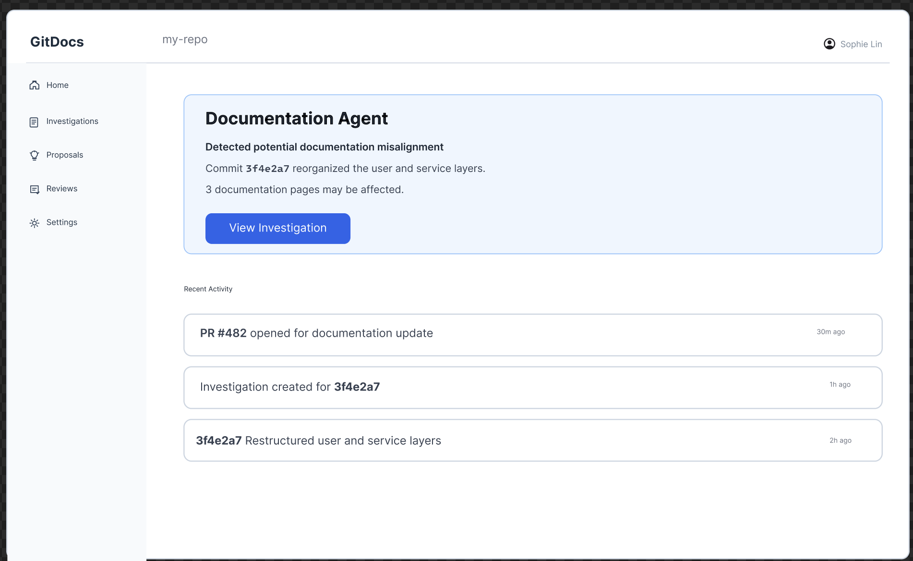
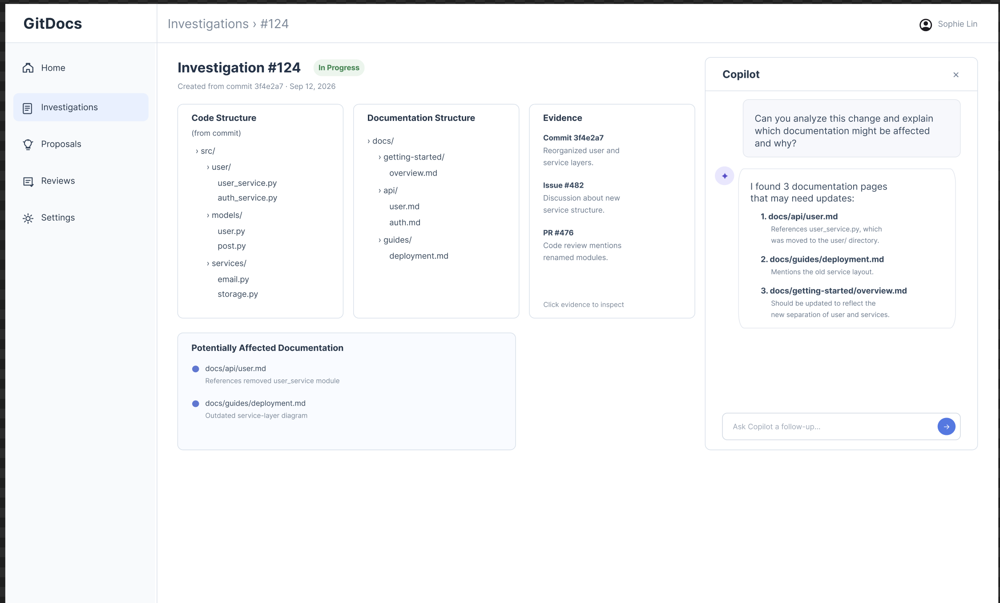
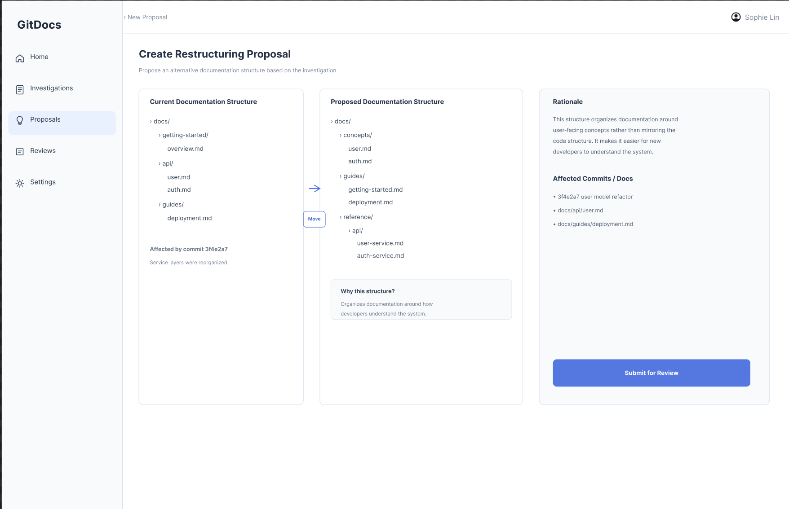
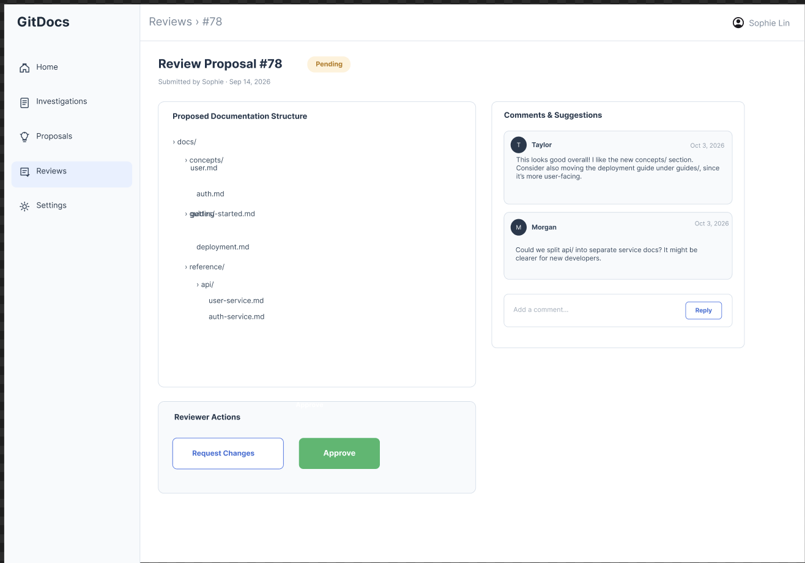
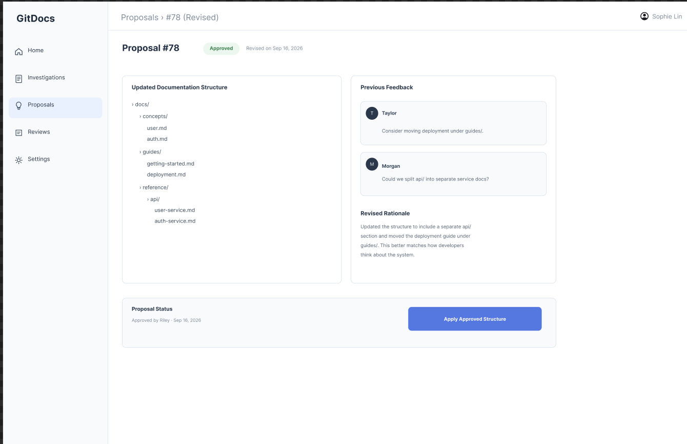
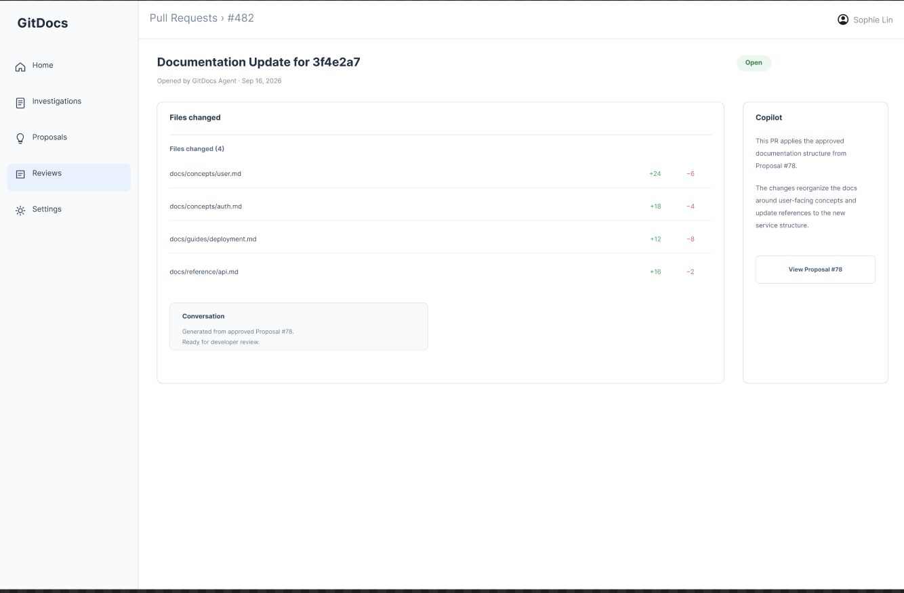

## UI Sketches

**[Figma Prototype](https://www.figma.com/design/7yWazQPFELlnye8SAIE0PA/GitDocs-Documentation-Workflow-Storyboard?node-id=0-1&t=AQi8FZt9Ab3JvehK-1)**

I tried to rescale some pages and it messed up the visuals a bit, so the scaling might look a bit off. However, the design flow should be clear!

### User Flow

1. **Agent Detection & Notification**: The agent detects a potentially affected documentation set.

   

2. **Investigation + Copilot**: The developer investigates the evidence and can ask Copilot questions.

   

3. **Restructuring Proposal**: The developer designs the alternative structure.

   

4. **Review**: Another developer comments and approves or requests changes.

   

5. **Revised Proposal**: The developer incorporates feedback.

   

6. **Pull Request**: GitDocs opens a PR containing the approved documentation changes.

   